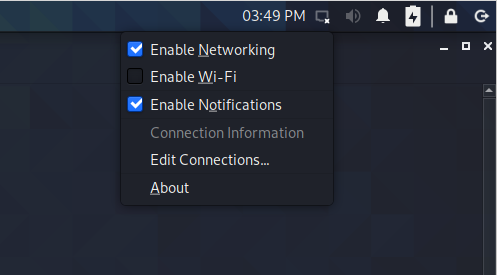
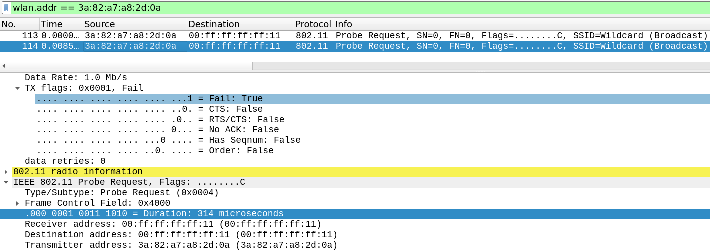
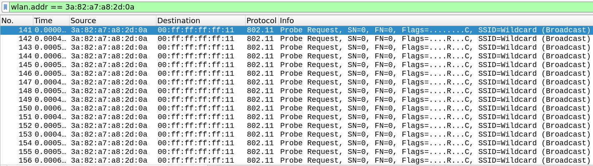

# Linux Wi-Fi Tutorial

This tutorial explains the basics of Wi-Fi packet injection on Linux.
This includes setting up a virtual test environment, understanding core Linux concepts regarding packet injection, introducing the basics of Scapy, and some common mistakes to avoid.

## Using simulated Wi-Fi interfaces

On Linux you can create software [simulated Wi-Fi interfaces](https://www.kernel.org/doc/html/latest/networking/mac80211_hwsim/mac80211_hwsim.html)
to more easily and reliably perform certain Wi-Fi experiments.
You can create simulated Wi-Fi interfaces with the following command:

	modprobe mac80211_hwsim radios=4

This will create 4 simulated Wi-Fi interfaces.
Here `mac80211_hwsim` represents a kernel module that will simulate the Wi-Fi interfaces.
The `modprobe` command is used to load this kernel module.
The above command will only work if your Linux distribution (by default) provides the `mac80211_hwsim` kernel module.
See [backport drivers](#id-backport-drivers) to manually compile this kernel module.

When loading this module, a special interface called `hwsim0` will also be created. This special interface captures
all frames coming through the simulated Wi-fi interfaces (over all channels). Enable the interface by executing
`ifconfig hwsim0 up` or similar. It's automatically in [monitor mode](#monitor-mode) but you cannot use it to
[inject frames](injecting-frames).

## Disabling Wi-Fi in your network manager

In many cases you want full control over the Wi-Fi card and don't want your operating system from interfering with experiments.
To prevent the network manager of Kali Linux (and other Linux distributions) from interfering with the script you can manually disable Wi-Fi:

You can also disable Wi-Fi through the command line:

	nmcli radio wifi off

After disabling Wi-Fi in your network manager, you will have to execute the following command to still be able to use Wi-Fi from the command line:

	rfkill unblock wifi

Alternatively, you can blacklist the MAC address of your Wi-Fi dongle so that Linux will automatically ignore the Wi-Fi dongle.
The advantage is that you can still use other Wi-Fi interfaces to connect to the internet. To blacklist a MAC address, add the [following lines](https://wiki.archlinux.org/index.php/NetworkManager#Ignore_specific_devices) to the file `/etc/NetworkManager/NetworkManager.conf`:

	[keyfile]
	unmanaged-devices=mac:02:00:00:00:00:00

Replace `02:00:00:00:00:00` with the MAC address of your Wi-Fi dongle and then reboot Linux. You can also use this to make the NetworkManager ignore certain virtualized Wi-Fi interfaces, such that those interfaces can be used directly with wpa_supplicant or hostap, while the other virtualized Wi-fi interfaces remain managed by the NetworkManager. For instance, you can blacklist an interface, use hostapd to create a network on that interface, and then this network created by hostapd should be visible in the Network Manager on the other virtualized interfaces.

If after doing all these steps you still notice interference from other programs, try to execute one of the following commands:

	# Check for programs that might interfere
	airmon-ng check
	# Kill programs that might interfere
	airmon-ng check kill
	# If all else fails, kill Wi-Fi programs the manual way
	pkill wpa_supplicant

## Compiling wpa_supplicant and hostap

First install some common dependencies:

	# Kali Linux and Ubuntu:
	sudo apt-get update
	sudo apt-get install libnl-3-dev libnl-genl-3-dev libnl-route-3-dev libssl-dev \
		libdbus-1-dev git pkg-config build-essential macchanger net-tools python3-venv \
		aircrack-ng rfkill

Get the latest development version of the hostap project, which provides both `wpa_supplicant` and `hostapd`:

	git clone git://w1.fi/srv/git/hostap.git

Compile hostapd:

	cd hostapd
	cp defconfig .config
	make clean
	make -j 4
	cd ..

Compile `wpa_supplicant`:

	cd wpa_supplicant
	cp defconfig .config
	make clean
	make -j 4
	cd ..

When compiling both `hostapd` and `wpa_supplicant` it's important to execute `make clean` before compiling. Otherwise the compilation might fail.
Note that executing `make clean` won't delete the compiled `hostapd` or `wpa_supplicant` executable.

## Starting hostapd and wpa_supplicant

You can start an access point by creating the file `hostapd.conf` with the following content:

	interface=wlan0
	ssid=testnetwork

	hw_mode=g
	channel=1

	# For both WPA2 and WPA3 we must specify wpa=2
	wpa=2
	# Use wpa_key_mgmt=SAE for WPA3
	wpa_key_mgmt=WPA-PSK
	rsn_pairwise=CCMP
	wpa_passphrase=abcdefgh

	# Optionally you can enable management frame protection
	#ieee80211w=1

And create the file `client.conf` with the following content:

	network={
		ssid="testnetwork"
		psk="abcdefgh"
	}

Now start the AP using:

	hostapd -dd -K hostapd.conf

And start the client using:

	wpa_supplicant -D nl80211 -i wlan1 -c client.conf -dd -K

The parameter `-D nl80211` means the modern `nl80211` API is used to communicate with the kernel.
The parameter `-i wlan` specifies the interface to use and `-c client.conf` the configuration of the network.
Finally, `-dd -K` causes verbose debug output and causes encryption keys to be printed, respectively.

## Compiling and starting IWD

Another open-source Wi-Fi client/AP is Intel's [IWD](https://wiki.archlinux.org/title/iwd).

See [iwd_usage.md](iwd_usage.md) on how to compile and use it on Linux.

## Enabling monitor mode

Most Wi-Fi cards supports monitor mode and can capture call nearby Wi-Fi frames on a given channel.
To put a Wi-Fi interface into monitor mode execute:

	ifconfig wlan0 down
	iw wlan0 set type monitor
	ifconfig wlan0 up
	iw wlan0 set channel 6

Remember to [disable Wi-Fi in your network manager](id-disable-wifi) so it will not interfere with the test tool.
As an alternative to the above commands you can also use:

	sudo airmon-ng start wlan0
	sudo iw wlan0mon set channel 6

This will usually create a second [virtual interface](#id-virtual-interface) called `wlan4mon` that can be used monitor and inject Wi-Fi frames.

Unfortunately not all Wi-Fi network cards support monitor mode.
You can execute `iw list` to determine whether a network card supports monitor mode:

	..
	Supported interface modes:
		 * IBSS
		 * managed
		 * AP
		 * AP/VLAN
		 * monitor
		 * P2P-client
		 * P2P-GO
		 * P2P-device
	..

The above output indicates that monitor mode is supported.

## Interface Capabilities

Not all Wi-Fi netword cards support the same features.
Execute `iw list` to output all the capabilities of the interface.
For instance, not all network cards can be used to create an access point.
This is only possible when `AP` is listed as a supported interface mode, for instance:

	..
	Supported interface modes:
		 * IBSS
		 * managed
		 * AP
		 * AP/VLAN
		 * monitor
		 * P2P-client
		 * P2P-GO
		 * P2P-device
	..

Note that what is commonly called "client" mode is called _managed_ mode throughout Linux.
The output of `iw list` will also include the support bands (e.g. 2.4 and 5 GHz) that are supported, the supported channels in each band, the supported encryption protocols, and all kinds of other features.

If you want to look up information about a device before buying it you can use [WikiDevi](https://deviwiki.com/), or one of its mirrors, to get basic information about a device.
It will for instance indicate the chipset and driver that a device uses.
If you're lucky it might also contain the output of `iw list`.

## Note on using real Wi-Fi interfaces

Some general tips when using real Wi-Fi dongles:
- You can inspect the output of `dmesg` to assure the kernel recognized the Wi-Fi network card
- `ifconfig` will only show the current active network interfaces. Use `ifconfig -a` to show _all_ network interfaces.

## Virtual Interfaces

### Background and example

On Linux it's possible to associate one physical network card with multiple _virtual_ interfaces.
For example, a physical network card can sometimes be used both as a client and an access point.

Another common combination is that a physical network card can be used as a client or acceess point, with a second virtual interface in monitor mode.
This can be done using the following command:

	iw wlan0 interface add wlan0mon type monitor

Make sure that the new interface, wlan0mon in the above example, has a short enough name.
Linux doesn't support interface names longer than [15 characters](https://elixir.bootlin.com/linux/v5.6/C/ident/IFNAMSIZ), so when providing a too long new network interface name, the above command would give an error.

### Details

The allowed combinations depend on the capabilities of the driver and network card and are included in the output of `iw list`:

	...
	software interface modes (can always be added):
		 * AP/VLAN
		 * monitor
	valid interface combinations:
		 * #{ managed } <= 1, #{ AP, P2P-client, P2P-GO } <= 1, #{ P2P-device } <= 1,
		   total <= 3, #channels <= 2
	...

For the above network card, we can always add a virtual AP/VLAN and virtual monitor interface.
At most two different channels can be used simultaneously.
And in total three (virtual) interface modes can be created (but AP/VLAN and monitor mode interfaces can always be added).

This is especially convenient to use a network card as a client or AP and then add a virtual monitor mode.
With this setup we can use the client and AP functionality of Linux, while using the virtual monitor interface to inject frames.
This is exactly what the framework automatically does behind the scenes.

In this tutorial we will call Wi-Fi interfaces provided by `mac80211_hwsim` _simulated_ interfaces and interfaces created using the above commands _virtual_ interfaces.
We will use the term _mixed mode_ when a physical network card is used in multiple modes simultaneously.

When using one interface to connect to a protected network and a virtual interface in monitor mode, then it's recommended to force software encryption/decryption.
Otherwise, when using hardware encryption/decryption, you might not see the original frame. This is because the network card itself might decrypt the frame meaning Linux won't have access to the original frame.
In general it's possible to enable software decryption by loading the driver with certain flags.
See [this script](https://github.com/vanhoefm/krackattacks-scripts/blob/research/krackattack/disable-hwcrypto.sh) for examples.

Note: when using an Intel card in client or AP mode and a second interface in monitor mode, then you won't be able to capture _all_ nearby Wi-Fi frames.
Instead, you will only see frames sent from or to the network card.
This behaviour can depend on the specific network card and driver.

## Injecting Frames

You can use [Scapy](https://scapy.readthedocs.io/en/latest/usage.html#wireless-frame-injection) to easily construct and inject raw Wi-Fi frames:

	iface = "wlan2"
	mymac = "00:11:22:33:44:55"
	p = Dot11(addr1="ff:ff:ff:ff:ff:ff", addr2=mymac, addr3="ff:ff:ff:ff:ff:ff")
	p = p/Dot11ProbeReq()/Dot11Elt(ID='SSID',info="")
	sendp(RadioTap()/p/essid, iface=iface)

The above code sends a broadcast probe request to all nearby Access Points (APs).

When you inject a raw Wi-Fi frame in monitor mode, you will see this frame twice in Wireshark.
The first frame is the one as injected by the userspace program or script, and the second frame is the one that was actually sent.
There can be slight differences between these frames: the Linux kernel might overwrite certain fields (e.g. it will add a FCS and might overwrite the duration field).

When injecting a Wi-Fi frame with a unicast reciever address the network card _might_ automatically retransmit the frame.
These retransmissions will not be shown in Wireshark. For instance, when injecting a probe request with as receiver 00:FF:FF:FF:FF:11 you will see:

Notice that the second occurrence of the injected frame has a TX flags field in its radiotap header with the "Fail" flag set.
This indicates that no acknowledgement was received in response.
Also notice that the kernel derived a value for the "Duration" field in the Wi-Fi header (we didn't specify a value for this field in Scapy).
When using a second independent network card to capture the injected frame, we will see that this frame was in fact retransmissed an additional 15 times:

Frames with a broadcast receiver address are (normally) only transmitted once when injected.
Note that some network cards may continue to retransmit a frame even though an acknowledgement was recieved.
This behaviour depends on the specific network card being used.

When another device send a frame with as receiver address the MAC address of the interface in monitor mode, then _some_ network cards may automatically send an acknowledgement (e.g. some Atheros cards).
Other network cards won't send an acknowledgement, causing the sender to retransmit the frame.

Advanced monitor and injection parameters are also available.
You can get a list of them by executing `iw --help | grep "set monitor" -A 10`:

	dev <devname> set monitor <flag>*
		Set monitor flags. Valid flags are:
		none:     no special flags
		fcsfail:  show frames with FCS errors
		control:  show control frames
		otherbss: show frames from other BSSes
		cook:     use cooked mode
		active:   use active mode (ACK incoming unicast packets)
		mumimo-groupid <GROUP_ID>: use MUMIMO according to a group id
		mumimo-follow-mac <MAC_ADDRESS>: use MUMIMO according to a MAC address

For instance, using the flag `active` you can instruct the device to send acknowledgements when another device transmits a frame with as receiver address the MAC address of the monitor interface.
Similarly, the flag `fcsfail` can be used to also show frames with an invalid Frame Check Sequence (FCS):

	iw wlan0 set monitor fcsfail

Unfortunately, few network cards implement these monitor flags properly or simply don't support them.
[Info on other flags is available online](https://aircrack-ng.blogspot.com/2017/02/monitor-mode-flags.html).

The bitrate that is used to inject a frame can be specified in the RadioTap header.
By default injected frames are sent at the lowest supported bitrate.
The precise behaviour of monitor mode (regarding retransmissions, acknowledgements, and used bitrates) changes when the network card is used in mixed mode (i.e. when the network card used as a client/AP with a virtual monitor interface).

In practice, the network card itself may also overwrite certain fields.
The only reliable method to detect this, and to assure that frames are properly injected, is by putting a second network card into monitor mode and to capture the frame that you injected.

Note: when using simulated network interfaces using `mac80211_hwsim`, you cannot use the special `hwsim0`
interface to inject frames. Frames must be injected using one of the "normal" `wlanX` interfaces.

## Troubleshooting checklist

When programming a new test or attack, make sure you don't have some of the following common programming mistakes:

- Correctly initialize FCfield when creating the header.
- Use Dot11 when constructing frames, not Dot11FCS.
- You cannot inject packets on `hwsim0`. This interface can only be used to capture packets.

In case the code still doesn't appear to be working, check the following:

0. [Use aireplay-ng to perform frame injection tests](https://www.aircrack-ng.org/doku.php?id=injection_test).

1. Check that no other process is using the network card (e.g. kill your network manager).

2. If everything worked previously, try unplugging your Wi-Fi dongle, restart your computer or virtual machine, and then try again.

3. Assure the device you are testing doesn't enter a sleep state (causing it to miss injected frames). Try to perform the tests using a different Wi-Fi card, it may change the timing of frames and cause things to work.

4. Use a second independent network card in monitor to verify that frames are being injected properly. Sometimes the kernel or network card itself may be overwriting certain fields.

5. Check that your system isn't generating background traffic that interferes with the tests. In particular, disable networking in your OS, manually kill your DHCP client/server, etc.

6. Confirm that you are connecting to the correct network. Double-check `client.conf`.

7. Make sure the device being tested is using an encryption algorithm and/or general configuration that you want.

8. If you are using a virtual machine, and you have issues configuring monitor mode, set the USB compatibility of the VM to match that of the USB port you are using, e.g., ensure that USB 3.1 is selected in the VM settings. Alternatively, try to run the framework and the tests from a native Linux installation (or a live USB image).

## Extra Sources

- [Emulating WLAN in Linux - part I: the 802.11 stack](https://www.linuxembedded.fr/2020/05/emulating-wlan-in-linux-part-i-the-80211-stack)
- [Emulating WLAN in Linux - part II: mac80211_hwsim](https://linuxembedded.fr/2021/01/emulating-wlan-in-linux-part-ii-mac80211hwsim)
